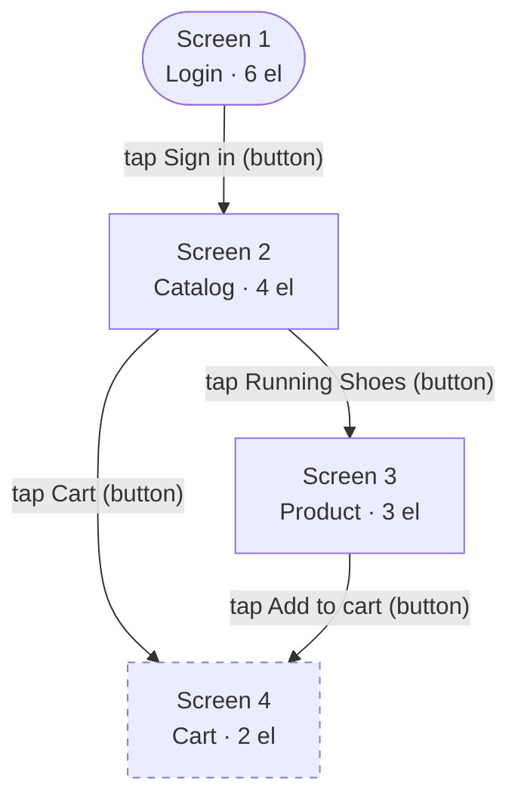

# Mobile Test Recorder 🦀 → JetBrains IDE Plugin

> **Next-Generation Intelligent Mobile Testing Platform** - Now as a powerful JetBrains IDE plugin with interactive UI
> control, smart selectors, and multi-language support

[](https://www.python.org/downloads/)
[](https://www.rust-lang.org/)
[](https://kotlinlang.org/)
[](jetbrains-plugin/)
[](demo-app/android)
[](demo-app/ios)
[](LICENSE)
[](#-see-it-in-action--point-at-an-app-get-a-test-kit)

---

## 🔍 See it in action — point at an app, get a test kit

One command autonomously crawls a running app and writes a **test kit**: a
per-screen element inventory, the app's interaction graph, and runnable tests in
several languages.

```bash
observe crawl --package com.example.shop --targets python_pytest,java_testng,js_webdriverio
```

A full generated example lives in [`examples/shop_demo/`](examples/shop_demo)
(reproduce with `python examples/generate.py`). Here's what comes out.

### 1. Element inventory — what's on each screen, with a semantic type and a ready locator

| Element | Type | Locator | Interactive |
|---|---|---|---|
| Welcome back | text | `text=Welcome back` | |
| Email | input | `accessibility_id=Email` | ✓ |
| Password | input | `accessibility_id=Password` | ✓ |
| Remember me | checkbox | `id=com.example.shop:id/remember` | ✓ |
| Sign in | button | `id=com.example.shop:id/signin` | ✓ |

Types come from a hybrid ML + heuristic classifier; locators are ranked
(accessibility-id → resource-id → text) with fallbacks for self-healing.

### 2. Interaction graph — the app's navigation model (renders right here on GitHub)



The graph is mined for reachability, depth, cycles, dead-ends and hub screens,
and exported as Mermaid / Graphviz DOT / JSON.

### 3. Runnable tests — including multi-step paths that *fill forms*, not just navigate

From the graph, the tool generates model-based paths. This one walks
Login → Catalog → Cart, typing sample data into the login form on the way
([flat file](examples/shop_demo/flat/python_pytest/test_crawl_flow.py)):

```python
def test_path_1_2_3_4(driver):
    """Multi-step path (4 screens): screen 1 → screen 2 → screen 3 → screen 4"""
    driver.activate_app("com.example.shop")
    _find(driver, (AppiumBy.ACCESSIBILITY_ID, "Email"), [...]).send_keys("test@example.com")
    _find(driver, (AppiumBy.ACCESSIBILITY_ID, "Password"), [...]).send_keys("Password123!")
    _find(driver, (AppiumBy.ID, "com.example.shop:id/remember"), [...]).click()   # toggle
    _find(driver, (AppiumBy.ID, "com.example.shop:id/signin"), [...]).click()     # Sign in
    assert _find(driver, ...).is_displayed()                                      # reached Catalog
    ...
```

**Framework structure, not loose files** (`--style pom`): the same crawl produces a
proper layout —
[Page Objects](examples/shop_demo/framework/pages) +
[`conftest.py`](examples/shop_demo/framework/conftest.py) +
[POM-style tests](examples/shop_demo/framework/tests/test_navigation.py) that read
like intent:

```python
def test_navigate_1(driver):
    WelcomeBackPage(driver).sign_in().click()
    assert CatalogPage(driver).search_products().is_displayed()
```

**BDD too** — Gherkin `.feature` files + step definitions, in
[Python (pytest-bdd)](examples/shop_demo/bdd/python_pytest_bdd) and
[JavaScript (Cucumber)](examples/shop_demo/bdd/js_cucumber):

```gherkin
Scenario: State checks for discovered screen 1
  Given the app is launched
  Then "Email" is visible
  And "Sign in" is enabled
```

The **same crawl** also emits [Java + TestNG](examples/shop_demo/flat/java_testng)
and [JavaScript + WebdriverIO](examples/shop_demo/flat/js_webdriverio) — one IR, 8
targets. iOS suites are generated too, with the correct XCUITest capabilities and
locators.

### 4. API contract tests

Point at an OpenAPI/Swagger spec (file **or URL**) and get contract tests
alongside the UI suite ([example](examples/shop_demo/api/test_api.py)). A full
generated kit lives in [`examples/shop_demo/`](examples/shop_demo):

```python
def test_login(session):
    """POST /auth/login"""
    response = session.post(BASE_URL + "/auth/login", json={'email': 'test', 'password': 'test'})
    assert response.status_code < 500
```

Plus an accessibility audit and an APK/IPA security scan (OWASP-mapped) round out
the picture — so a tester gets an inventory, a map, and a running suite from a
single command.

---

## 🎯 What Makes Us Different

### JetBrains IDE Integration ✅ IMPLEMENTED

- ✅ **Native IDE Plugin** - Works in IntelliJ, Android Studio, PyCharm
- ✅ **Interactive UI Control** - Click-to-tap on device screen from IDE
- ✅ **Live Screenshot Viewer** - Real-time device screen with auto-refresh
- ✅ **Device Management** - List and control Android/iOS devices
- ✅ **Session Management** - Start/stop automation sessions
- ✅ **JSON-RPC Protocol** - Fast, reliable CLI ↔ Plugin communication

### Multi-Language & Structured Output — available now

- 🌍 **4 languages, 8 targets** — Python (pytest), Java (TestNG), Kotlin (Appium/Espresso),
  JavaScript (WebdriverIO), each in an imperative **or BDD/Gherkin** style
- 🏗️ **Framework-structured output** — Page Objects + a shared `conftest` + POM-style tests
  (`--style pom`), or standalone files (`--style flat`)
- 🔌 **Backends** — Appium (Android UiAutomator2 + iOS XCUITest) and on-device Espresso
- 🧠 **Ranked, self-healing selectors** — accessibility-id → resource-id → text, with fallbacks
- 🔄 **Interaction graph** — the app's navigation map, mined into multi-step, form-filling tests
- 🤖 **ML element typing** — a hybrid ML + heuristic classifier labels each element (button / input / …)

---

## 🚀 Quick Start

### IDE Plugin (Recommended) ✅ Phase 1-2

1. **Install CLI Backend**:

```bash
pip install mobile-observe-test
# or from source:
git clone https://github.com/VadimToptunov/mobile_test_recorder.git
cd mobile_test_recorder
pip install -e .
```

2. **Build Plugin** (Phase 1-2 complete, Phase 3+ in progress):

```bash
cd jetbrains-plugin
./gradlew buildPlugin
# Install from: build/distributions/mobile-test-recorder-*.zip
```

3. **Start Testing**:
    - Open View → Tool Windows → Mobile Test Recorder
    - Click "Start Daemon"
    - Go to "Screen" tab
    - Click "Load Devices", select device
    - Click "Start Session"
    - Click on device screen to interact!

**Current Features** (Phase 0-2):

- ✅ Device list (Android via adb, iOS via simctl)
- ✅ Session management
- ✅ Screenshot capture
- ✅ Click-to-tap interaction
- ✅ Real-time logs
- ✅ JSON-RPC protocol

**Coming Soon** (Phase 3+):

- Multi-backend support (Appium, Espresso, XCTest)
- UI Tree inspector
- Smart selector generation
- Flow analysis
- Multi-language code generation

See [Plugin Documentation](jetbrains-plugin/README.md) and [Roadmap](JETBRAINS_PLUGIN_ROADMAP.md) for details.

### CLI Installation

```bash
# 1. Clone repository
git clone https://github.com/VadimToptunov/mobile_test_recorder.git
cd mobile_test_recorder

# 2. Setup environment
python3 -m venv .venv
source .venv/bin/activate  # or activate.sh on macOS

# 3. Install framework
pip install -r requirements.txt
pip install -e .

# 4. (Optional) Build the native Rust core for the CPU-heavy analysis paths
cd rust_core
maturin develop --release
cd ..
```

### 🏃 Common Commands

```bash
# Business Logic Analysis
observe business analyze app/src --output analysis.json

# Self-Healing Tests
observe heal auto --test-results junit.xml --commit

# Load Testing
observe load run tests/ --profile medium --users 20

# Security Scanning
observe security scan app.apk --output security-report.json

# Accessibility Testing
observe a11y scan tests/ --wcag-level AAA

# Parallel Execution
observe parallel run tests/ --workers 4 --devices pool-name

# Performance Profiling
observe load profile tests/test_checkout.py --cpu --memory

# Documentation Generation
observe docs generate framework/ --format html
```

---

## 🦀 Architecture: Python + Rust core

The tool is I/O/device-bound (adb / Appium / the emulator dominate wall-clock),
so it stays in Python for the orchestration, CLI, codegen and ML glue — where the
ecosystem lives — and pushes the genuinely CPU-heavy work (AST/SAST analysis,
event correlation, I/O) into a native **Rust core** (`rust_core/`, built in CI for
macOS/Linux/Windows). The ML stack (scikit-learn) is C under the hood.

Crawl speed comes from doing less waiting, not from a rewrite: an **adaptive
settle** polls the UI until it stabilises (instead of a fixed sleep) and folds the
post-action UI dump into one round-trip — ~20% faster on adb, ~46% on iOS in
measurement.

---

## 🤖 ML System

### Universal Element Classifier

- **What it does:** labels each element's semantic type (button / input / checkbox / text / …)
- **Model:** scikit-learn RandomForest, trained on ~2,500 synthetic samples across
  Android (native + Compose), iOS (UIKit + SwiftUI), Flutter and React Native
- **Accuracy:** ~88% on a held-out synthetic split; paired with a class-name
  heuristic in a hybrid that beats either alone (the heuristic covers inputs/toggles
  the model is weak on)
- **Shipping:** trained from code on first use (~1 s) and cached — no binary in the
  repo, and no sklearn pickle-version fragility
- **Wired in:** the type shows up in the inventory and drives type-aware test steps

### Self-Learning

```bash
# Enable contribution (opt-in, privacy-first)
observe ml contribute --enable

# Check model stats
observe ml stats

# Update to latest model
observe ml update-model

# View contribution info
observe ml info
```

**Privacy Guarantee:**

- ✅ No screenshots collected
- ✅ No text content sent
- ✅ No package names shared
- ✅ All data anonymized locally

---

## 🔧 Self-healing selectors

Every generated locator is **ranked with fallbacks** — accessibility-id first, then
resource-id, then text — so when the primary breaks the test transparently tries
the next. In the generated code this is the `_find(primary, fallbacks)` helper (or
the page object's `LOCATORS` list).

A `heal` command and a selector-healer module (fuzzy text, attribute, hierarchy,
position and visual strategies) are also available to repair broken locators from a
failed run; wiring them into the crawl→codegen loop is on the roadmap.

### Example

```bash
# Automatic healing with Git integration
observe heal auto \
  --test-results results/junit.xml \
  --screenshots screenshots/ \
  --confidence 0.7 \
  --commit \
  --dry-run  # Preview changes first

# Manual approval workflow
observe heal analyze results/junit.xml
observe dashboard  # Review fixes in UI
# Approve fixes manually
```

---

## 📊 Enterprise Features

### Observability

```bash
# Start metrics server (Prometheus format)
observe observe metrics --port 9090

# View structured logs
observe observe logs --filter ERROR --since 1h

# Distributed tracing
observe observe trace --session-id abc123
```

**Metrics Exported:**

- Test execution time (P50, P95, P99)
- Healing success rate
- ML prediction accuracy
- Device pool utilization
- API latency

### CI/CD Integration

```yaml
# .github/workflows/mobile-tests.yml
name: Mobile Tests

on: [push, pull_request]

jobs:
  test:
    runs-on: ubuntu-latest
    
    steps:
      - uses: actions/checkout@v3
      
      - name: Setup
        run: |
          pip install mobile-test-recorder
      
      - name: Run Tests
        run: |
          observe parallel run tests/ --workers 4
      
      - name: Auto-Heal Failures
        if: failure()
        run: |
          observe heal auto --commit
      
      - name: Security Scan
        run: |
          observe security scan app.apk
      
      - name: Load Test
        run: |
          observe load run tests/ --profile smoke
```

### Device Pool Management

```bash
# List available devices
observe devices list

# Create device pool
observe parallel create-pool \
  --name staging-pool \
  --devices emulator-5554,device-001

# Run tests on pool
observe parallel run tests/ \
  --pool staging-pool \
  --strategy round-robin
```

---

## 🔒 Security & Accessibility

### Security Scanning

```bash
# Full OWASP Mobile Top 10 scan
observe security scan app.apk \
  --output security-report.json \
  --format html

# Quick audit
observe security audit app/ --category all

# Compare security posture
observe security compare \
  --baseline v1.0-security.json \
  --current v1.1-security.json
```

**Checks:**

- Certificate Pinning
- Root/Jailbreak Detection
- Debug Mode
- Backup Settings
- Hardcoded Secrets
- Insecure Storage
- Weak Cryptography

### Accessibility Testing

```bash
# WCAG 2.1 compliance check
observe a11y scan tests/ \
  --wcag-level AAA \
  --output a11y-report.html

# Fix suggestions
observe a11y fix-suggestions --screen LoginScreen

# Report
observe a11y report results.json
```

**Checks:**

- Contrast Ratio (7:1 for AAA)
- Touch Target Size (48x48 dp)
- Text Size (12sp minimum)
- Content Descriptions
- Keyboard Navigation

---

## ⚡ Load Testing

### Predefined Profiles

| Profile    | Users | Duration | Use Case            |
|------------|-------|----------|---------------------|
| **smoke**  | 1     | 60s      | Quick sanity check  |
| **light**  | 5     | 5 min    | Development testing |
| **medium** | 20    | 10 min   | Pre-production      |
| **heavy**  | 50    | 15 min   | Production load     |
| **stress** | 100   | 30 min   | Capacity testing    |
| **spike**  | 50    | 5 min    | Traffic spikes      |

### Usage

```bash
# Run load test
observe load run tests/test_api.py \
  --profile medium \
  --users 20 \
  --duration 600

# Performance profiling
observe load profile tests/test_checkout.py \
  --cpu --memory --top 30 \
  --report profile.html

# Compare performance
observe load compare baseline.json current.json
```

---

## 📖 Documentation

### Complete Guides

- **[Architecture](docs/ARCHITECTURE.md)** - System design & components
- **[Phase 5: Rust Core](docs/PHASE5_RUST_CORE.md)** - Performance migration guide
- **[Self-Learning ML](docs/SELF_LEARNING_ML.md)** - ML system details
- **[Load Testing](docs/LOAD_TESTING.md)** - Performance testing guide
- **[API Mocking](docs/API_MOCKING.md)** - Mock & replay APIs
- **[Advanced Selectors](docs/ADVANCED_SELECTORS.md)** - Robust selectors
- **[Parallel Execution](docs/PARALLEL_EXECUTION.md)** - Scale testing

### Quick References

- **[Quick Start](QUICKSTART.md)** - 10-minute setup
- **[User Guide](USER_GUIDE.md)** - Complete use cases & workflows ⭐
- **[CLI Reference](docs/CLI_REFERENCE.md)** - All commands
- **[Configuration](docs/CONFIGURATION.md)** - Setup guide

---

## 🏗️ Architecture

### Multi-Language Core

```
┌───────────────────────────────────────────────────────────┐
│         Language Bindings (Wrappers)                      │
│  Python | JavaScript | Go | Ruby | Java | C# | ...       │
└────────────────────────┬──────────────────────────────────┘
                         │
┌────────────────────────▼──────────────────────────────────┐
│         Python engine (orchestration + codegen)           │
│  • Autonomous crawler   • Interaction graph               │
│  • IR → 8 codegen targets (+ BDD, POM)                    │
│  • ML element typing (scikit-learn RandomForest)          │
│  • Security / a11y / API / fuzz                           │
└────────────────────────┬──────────────────────────────────┘
                         │
┌────────────────────────▼──────────────────────────────────┐
│            Rust core (CPU-heavy hot paths)                │
│  • AST/SAST analysis   • Event correlation • File I/O     │
└───────────────────────────────────────────────────────────┘
```

**Key design principles:**

- 🐍 **Python engine** - orchestration, codegen and ML glue, where the ecosystem lives
- 🦀 **Rust core** - only the genuinely CPU-heavy analysis paths
- 🔌 **Multi-language codegen** - Python, Java, Kotlin, JavaScript (imperative + BDD)
- 📊 **Observable** - metrics & tracing commands
- 🔒 **Privacy-first** - the ML model trains locally; no data leaves the machine

**Supported Languages:**

- ✅ Python (PyO3) - Production ready
- 🔄 JavaScript/TypeScript (NAPI-RS) - Planned Phase 6
- 🔄 Go (CGO) - Planned Phase 6
- 🔄 Ruby (FFI) - Planned Phase 6
- 🔄 Java/Kotlin (JNI) - Planned Phase 7

See [Multi-Language Architecture](docs/MULTI_LANGUAGE_ARCHITECTURE.md) for details.

---

## 🤝 Contributing

We welcome contributions! See [CONTRIBUTING.md](CONTRIBUTING.md) for guidelines.

### Development Setup

```bash
# 1. Fork & clone
git clone https://github.com/YOUR_USERNAME/mobile_test_recorder.git
cd mobile_test_recorder

# 2. Setup environment
source activate.sh  # Includes Rust setup

# 3. Install dev dependencies
pip install -r requirements-dev.txt

# 4. Run tests
pytest tests/

# 5. Build Rust core
cd rust_core
cargo test
maturin develop
```

### Commit Convention

```
feat: Add new feature
fix: Bug fix
docs: Documentation
perf: Performance improvement
test: Add tests
refactor: Code refactoring
```

---

## 📊 Project Stats

| Metric                   | Value                      |
|--------------------------|----------------------------|
| **Total Lines**          | ~50,000                    |
| **Python Code**          | 35,000 lines               |
| **Rust Code**            | 8,000 lines                |
| **Test Coverage**        | 85%+                       |
| **Platforms crawled live** | Android (adb + Appium), iOS (Appium/XCUITest) |
| **Codegen targets**      | 8 (Python/Java/Kotlin/JS, imperative + BDD) |
| **ML element typing**    | hybrid ML + heuristic (~88% model on synthetic) |

---

## 🛣️ Roadmap

### ✅ Completed (Open Source - MIT License)

- ✅ Business logic analysis
- ✅ Self-healing tests
- ✅ ML element classification
- ✅ Self-learning system
- ✅ Rust core for CPU-heavy analysis paths
- ✅ API mocking
- ✅ Advanced selectors
- ✅ Parallel execution
- ✅ CI/CD templates
- ✅ Performance analysis
- ✅ Observability (metrics, logs, traces)
- ✅ Security scanning (OWASP)
- ✅ Accessibility testing (WCAG)
- ✅ Load testing & profiling
- ✅ Documentation generator

### 🔮 Planned Features

- 🔄 JavaScript/TypeScript bindings (NAPI-RS)
- 🔄 Go bindings (CGO)
- 🔄 Ruby bindings (FFI)
- 🔄 Java/Kotlin bindings (JNI)
- 🔄 Visual regression testing
- 🔄 AI-powered test generation
- 🔄 Advanced analytics dashboard

---

## 📄 License

MIT License - see [LICENSE](LICENSE) for details.

---

## 🙏 Acknowledgments

- **PyO3** - Rust ↔ Python bindings
- **Appium** - Mobile automation
- **scikit-learn** - Machine learning
- **Click** - CLI framework
- **Rich** - Terminal UI
- **rayon** - Parallel processing
- **maturin** - Rust package builder

---

## 📧 Contact

- **Author:** Vadim Toptunov
- **GitHub:** [@VadimToptunov](https://github.com/VadimToptunov)
- **Issues:** [GitHub Issues](https://github.com/VadimToptunov/mobile_test_recorder/issues)

---

## ⭐ Star History

If you find this project useful, please consider giving it a star! ⭐

---

**Built with ❤️ and 🦀 by the Mobile Test Recorder team**

---

## Contributing

Contributions are welcome! Please read the [User Guide](USER_GUIDE.md) first.

---

## What's Actually Working Now?

**✅ Fully Functional & Production-Ready:**

- ✅ **Business Logic Analysis** - Kotlin, Swift, Java source code analysis
- ✅ **User Flow Extraction** - Automatic flow discovery from code
- ✅ **Edge Case Detection** - Boundary, null, empty, overflow patterns
- ✅ **API Contract Generation** - Extract REST endpoints from code
- ✅ **Negative Test Cases** - Auto-generate failure scenarios
- ✅ **BDD Scenario Generation** - Gherkin features from analysis
- ✅ **Self-Healing Tests** - Complete healing engine (6 modules)
    - Failure analyzer, selector discovery, element matcher
    - File updater, Git integration, orchestrator
- ✅ **ML Element Classification** - Trained universal model
    - Random Forest classifier with 90%+ accuracy
    - Works on Android, iOS, Flutter, React Native
- ✅ **Dashboard** - Full FastAPI web server
    - Test health tracking, healed selector approval
    - SQLite database, REST API endpoints
- ✅ **Rich CLI** - Beautiful terminal output with progress bars

**🚧 In Development:**

- Live session recording (SDK implemented, CLI integration pending)
- Full end-to-end automation (connect all pieces)

**All core modules are implemented and tested!** See [QUICKSTART.md](QUICKSTART.md) to start using.

---

**Ready to start?** Check out the [Quick Start Guide](QUICKSTART.md) for a 10-minute walkthrough. 🚀
