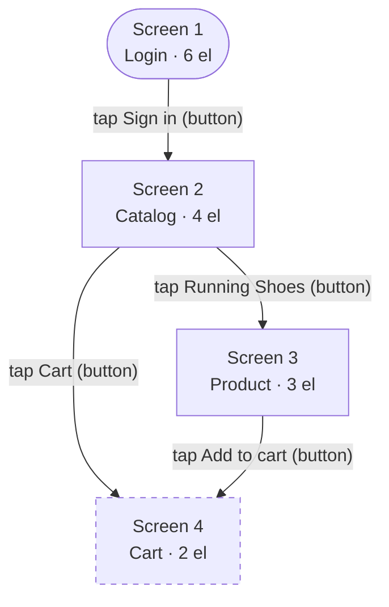

# Mobiscout 🦀 → JetBrains IDE Plugin

> **Next-Generation Intelligent Mobile Testing Platform** - Now as a powerful JetBrains IDE plugin with interactive UI
> control, smart selectors, and multi-language support

[](https://www.python.org/downloads/)
[](https://www.rust-lang.org/)
[](https://kotlinlang.org/)
[](jetbrains-plugin/)
[](demo-app/android)
[](demo-app/ios)
[](LICENSE)
[](#-see-it-in-action--point-at-an-app-get-a-test-kit)

---

## 🔍 See it in action — point at an app, get a test kit

One command autonomously crawls a running app and writes a **test kit**: a
per-screen element inventory, the app's interaction graph, and runnable tests in
several languages.

```bash
mobiscout crawl --package com.example.shop --targets python_pytest,java_testng,js_webdriverio
```

A full generated example lives in [`examples/shop_demo/`](examples/shop_demo)
(reproduce with `python examples/generate.py`). Here's what comes out. It's
**illustrative** — `generate.py` runs the real emitters over a representative,
device-free crawl fixture so the output is deterministic in the repo; a live crawl of an
app produces the same shapes from that app's screens.

### 1. Element inventory — what's on each screen, with a semantic type and a ready locator

| Element | Type | Locator | Interactive |
|---|---|---|---|
| Welcome back | text | `text=Welcome back` | |
| Email | input | `accessibility_id=Email` | ✓ |
| Password | input | `accessibility_id=Password` | ✓ |
| Remember me | checkbox | `id=com.example.shop:id/remember` | ✓ |
| Sign in | button | `id=com.example.shop:id/signin` | ✓ |

Types come from a hybrid ML + heuristic classifier; locators are ranked
(accessibility-id → resource-id → text) with fallbacks for self-healing.

### 2. Interaction graph — the app's navigation model (renders right here on GitHub)


```mermaid
flowchart TD
    N1(["Screen 1<br/>Login · 6 el"])
    N2["Screen 2<br/>Catalog · 4 el"]
    N3["Screen 3<br/>Product · 3 el"]
    N4["Screen 4<br/>Cart · 2 el"]
    N1 -->|"tap Sign in (button)"| N2
    N2 -->|"tap Running Shoes (button)"| N3
    N2 -->|"tap Cart (button)"| N4
    N3 -->|"tap Add to cart (button)"| N4
    class N4 deadend;
    classDef deadend stroke-dasharray: 5 5;
```

The graph is mined for reachability, depth, cycles, dead-ends and hub screens,
and exported as Mermaid / Graphviz DOT / JSON.

### 3. Runnable tests — including multi-step paths that *fill forms*, not just navigate

From the graph, the tool generates model-based paths. This one walks
Login → Catalog → Cart, typing sample data into the login form on the way
([flat file](examples/shop_demo/flat/python_pytest/test_crawl_flow.py)):

```python
def test_path_1_2_3_4(driver):
    """Multi-step path (4 screens): screen 1 → screen 2 → screen 3 → screen 4"""
    driver.activate_app("com.example.shop")
    _find(driver, (AppiumBy.ACCESSIBILITY_ID, "Email"), [...]).send_keys("test@example.com")
    _find(driver, (AppiumBy.ACCESSIBILITY_ID, "Password"), [...]).send_keys("Password123!")
    _find(driver, (AppiumBy.ID, "com.example.shop:id/remember"), [...]).click()   # toggle
    _find(driver, (AppiumBy.ID, "com.example.shop:id/signin"), [...]).click()     # Sign in
    assert _find(driver, ...).is_displayed()                                      # reached Catalog
    ...
```

**Framework structure, not loose files** (`--style pom`): the same crawl also produces a
proper layout — [Page Objects](examples/shop_demo/framework/pages) +
[`conftest.py`](examples/shop_demo/framework/conftest.py) +
[navigation tests](examples/shop_demo/framework/tests/test_navigation.py) and
[flow tests](examples/shop_demo/framework/tests/test_flows.py) that read like intent.
The POM style carries the **same behavioural coverage as `flat`** — form-filling,
multi-step journeys and negative cases — rendered as page-object method calls instead of
raw locators. Pick `flat` for standalone files, `pom` for a maintainable framework layout:

```python
def test_navigate_1(driver):
    WelcomeBackPage(driver).sign_in().click()
    assert CatalogPage(driver).search_products().is_displayed()
```

**BDD too** — Gherkin `.feature` files + step definitions, in
[Python (pytest-bdd)](examples/shop_demo/bdd/python_pytest_bdd) and
[JavaScript (Cucumber)](examples/shop_demo/bdd/js_cucumber):

```gherkin
Scenario: State checks for discovered screen 1
  Given the app is launched
  Then "Email" is visible
  And "Sign in" is enabled
```

The **same crawl** also emits [Java + TestNG](examples/shop_demo/flat/java_testng)
and [JavaScript + WebdriverIO](examples/shop_demo/flat/js_webdriverio) — one IR, 8
targets. iOS suites are generated too, with the correct XCUITest capabilities and
locators.

### 4. API contract tests

Get contract tests (pytest + requests) from any of three inputs — the app's own
**source** (Retrofit on Android, URLSession on iOS), an **OpenAPI/Swagger** spec
(file or URL), or **captured traffic** (a proxy HAR):

```bash
mobiscout generate api-tests --source ./app/src        # extract the API the app calls
mobiscout generate api-tests --openapi openapi.yaml    # from the backend's spec
mobiscout api analyze capture.har --emit-tests tests/  # from recorded traffic
mobiscout crawl --package com.x.app --har capture.har  # UI tests + API tests in one kit
```

Each test asserts the status the API documents (else that it did not 5xx) and, when
a response schema is known, that a success body carries the documented fields.

### 5. Tests from source (no device)

Point at the app's **source** and get runnable UI tests from the screens/elements
in the code — Android/Compose and iOS/SwiftUI:

```bash
mobiscout generate tests --source ./app/src --app-package com.x.app
```

Generated pytest is **environment-configurable**: set `MOBISCOUT_APPIUM_SERVER`
(hub URL) and `MOBISCOUT_EXTRA_CAPS` (JSON capabilities) to run the same suite on
a cloud grid or a different server without regenerating.

> Static source analysis and the live crawl support **Android and iOS**. (The ML
> element classifier is additionally trained on Flutter/React Native samples, but
> those aren't yet analyzable/crawlable platforms.)

Plus an accessibility audit and an APK/IPA security scan (OWASP-mapped) round out
the picture — so a tester gets an inventory, a map, and a running suite from a
single command.

---

## 🎯 What Makes Us Different

### JetBrains IDE Integration ✅ IMPLEMENTED

- ✅ **Native IDE Plugin** - Works in IntelliJ, Android Studio, PyCharm
- ✅ **Interactive UI Control** - Click-to-tap on device screen from IDE
- ✅ **Live Screenshot Viewer** - Real-time device screen with auto-refresh
- ✅ **Device Management** - List and control Android/iOS devices
- ✅ **Session Management** - Start/stop automation sessions
- ✅ **JSON-RPC Protocol** - Fast, reliable CLI ↔ Plugin communication

### Multi-Language & Structured Output — available now

- 🌍 **4 languages, 8 targets** — Python (pytest), Java (TestNG), Kotlin (Appium/Espresso),
  JavaScript (WebdriverIO), each in an imperative **or BDD/Gherkin** style
- 🏗️ **Framework-structured output** — Page Objects + a shared `conftest` + POM-style tests
  (`--style pom`), or standalone files (`--style flat`)
- 🔌 **Backends** — Appium (Android UiAutomator2 + iOS XCUITest) and on-device Espresso
- 🧠 **Ranked, self-healing selectors** — accessibility-id → resource-id → text, with fallbacks
- 🔄 **Interaction graph** — the app's navigation map, mined into multi-step, form-filling tests
- 🤖 **ML element typing** — a hybrid ML + heuristic classifier labels each element (button / input / …)

---

## 🚀 Quick Start

### IDE Plugin (Recommended) ✅ Phase 1-2

1. **Install CLI Backend**:

```bash
# From source (for developers; end users just install the plugin — it bundles the engine, no Python needed):
git clone https://github.com/VadimToptunov/Mobiscout.git
cd mobile_test_recorder
pip install -e .
```

2. **Build Plugin** (Phase 1-2 complete, Phase 3+ in progress):

```bash
cd jetbrains-plugin
./gradlew buildPlugin
# Install from: build/distributions/mobiscout-*.zip
```

3. **Start Testing**:
    - Open View → Tool Windows → Mobiscout
    - Click "Start Daemon"
    - Go to "Screen" tab
    - Click "Load Devices", select device
    - Click "Start Session"
    - Click on device screen to interact!

**Live control (the tool window):**

- ✅ Device list (Android via adb, iOS via simctl)
- ✅ Session management, screenshot capture, click-to-tap interaction
- ✅ Real-time logs, JSON-RPC protocol

**Delivered by the engine (the crawl → kit flow):**

- ✅ Multi-backend crawling (Android over adb + Appium/UiAutomator2, iOS over Appium/XCUITest)
- ✅ UI-tree inspection, smart ranked-fallback selector generation
- ✅ Interaction-graph flow analysis, and code generation across 8 targets (Python/Java/Kotlin/JS, imperative + BDD)

See the [Release Roadmap](ROADMAP.md) for where the product is headed, and the
[Plugin Documentation](jetbrains-plugin/README.md) / [engineering roadmap](JETBRAINS_PLUGIN_ROADMAP.md) for details.

### CLI Installation

```bash
# 1. Clone repository
git clone https://github.com/VadimToptunov/Mobiscout.git
cd mobile_test_recorder

# 2. Setup environment
python3 -m venv .venv
source .venv/bin/activate  # or activate.sh on macOS

# 3. Install framework
pip install -r requirements.txt
pip install -e .

# 4. (Optional) Build the native Rust core for the CPU-heavy analysis paths
cd rust_core
maturin develop --release
cd ..
```

### 🏃 Common Commands

```bash
# Business Logic Analysis
mobiscout business analyze app/src --output analysis.json

# Self-Healing Tests
mobiscout heal auto --test-results junit.xml --commit

# Load Testing
mobiscout load run tests/ --profile medium --users 20

# Security Scanning
mobiscout security scan app.apk --output security-report.json

# Accessibility Testing
mobiscout a11y scan tests/ --wcag-level AAA

# Parallel Execution
mobiscout parallel run tests/ --workers 4 --devices pool-name

# Performance Profiling
mobiscout load profile tests/test_checkout.py --cpu --memory

# Documentation Generation
mobiscout docs generate framework/ --format html

# Analyze captured API traffic (HAR) into test assertions
mobiscout api analyze capture.har --output api-report

# Map an app's structure from its source, to plan a crawl
mobiscout source analyze ./app/src --output structure.json

# Record a crawl as a queryable session (opt-in; never affects crawl speed),
# then browse it
mobiscout crawl --package com.example.app --record-events session.db
mobiscout events timeline session.db

# Import RICO real-app data to sharpen ML element typing
mobiscout ml import-rico --rico-dir ./rico --merge-shipped
```

---

## 🦀 Architecture: Python + Rust core

The tool is I/O/device-bound (adb / Appium / the emulator dominate wall-clock),
so it stays in Python for the orchestration, CLI, codegen and ML glue — where the
ecosystem lives — and pushes the genuinely CPU-heavy work (AST/SAST analysis,
event correlation, I/O) into a native **Rust core** (`rust_core/`, built in CI for
macOS/Linux/Windows). The ML stack (scikit-learn) is C under the hood.

Crawl speed comes from doing less waiting, not from a rewrite: an **adaptive
settle** polls the UI until it stabilises (instead of a fixed sleep) and folds the
post-action UI dump into one round-trip — ~20% faster on adb, ~46% on iOS in
measurement.

---

## 🤖 ML System

### Universal Element Classifier

- **What it does:** labels each element's semantic type (button / input / checkbox / text / …)
- **Model:** scikit-learn RandomForest, trained on ~2.5K synthetic samples across
  Android (native + Compose), iOS (UIKit + SwiftUI), Flutter and React Native
- **Accuracy:** ~95% on a held-out synthetic split; paired with a class-name
  heuristic in a hybrid that beats either alone (the heuristic covers inputs/toggles
  the model is weak on)
- **Shipping:** trained from code on first use (~1 s) and cached — no binary in the
  repo, and no sklearn pickle-version fragility
- **Wired in:** the type shows up in the inventory and drives type-aware test steps

---

## 🔧 Self-healing selectors

Every generated locator is **ranked with fallbacks** — accessibility-id first, then
resource-id, then text — so when the primary breaks the test transparently tries
the next. In the generated code this is the `_find(primary, fallbacks)` helper (or
the page object's `LOCATORS` list).

A `heal` command and a selector-healer module (fuzzy text, attribute, hierarchy,
position and visual strategies) are also available to repair broken locators from a
failed run; wiring them into the crawl→codegen loop is on the roadmap.

### Example

```bash
# Automatic healing with Git integration
mobiscout heal auto \
  --test-results results/junit.xml \
  --screenshots screenshots/ \
  --confidence 0.7 \
  --commit \
  --dry-run  # Preview changes first

# Manual approval workflow
mobiscout heal analyze results/junit.xml
mobiscout dashboard  # Review fixes in UI
# Approve fixes manually
```

---

## 📊 Enterprise Features

### Observability

```bash
# Start metrics server (Prometheus format)
mobiscout observe metrics --port 9090

# View structured logs
mobiscout observe logs --filter ERROR --since 1h

# Distributed tracing
mobiscout observe trace --session-id abc123
```

**Metrics Exported:**

- Test execution time (P50, P95, P99)
- Healing success rate
- ML prediction accuracy
- Device pool utilization
- API latency

### CI/CD Integration

```yaml
# .github/workflows/mobile-tests.yml
name: Mobile Tests

on: [push, pull_request]

jobs:
  test:
    runs-on: ubuntu-latest
    
    steps:
      - uses: actions/checkout@v3
      
      - name: Setup
        run: |
          pip install -e .
      
      - name: Run Tests
        run: |
          mobiscout parallel run tests/ --workers 4
      
      - name: Auto-Heal Failures
        if: failure()
        run: |
          mobiscout heal auto --commit
      
      - name: Security Scan
        run: |
          mobiscout security scan app.apk
      
      - name: Load Test
        run: |
          mobiscout load run tests/ --profile smoke
```

### Device Pool Management

```bash
# List available devices
mobiscout devices list

# Create device pool
mobiscout parallel create-pool \
  --name staging-pool \
  --devices emulator-5554,device-001

# Run tests on pool
mobiscout parallel run tests/ \
  --pool staging-pool \
  --strategy round-robin
```

---

## 🔒 Security & Accessibility

### Security Scanning

Scans an APK/IPA against the OWASP Mobile Top 10 categories: it reads the app's
embedded strings for hardcoded secrets and checks obfuscation for real (stdlib
only). Full manifest/bytecode analysis uses `apktool`/`androguard` when installed;
the report is explicit about anything it could not inspect, so an empty result is
never presented as "secure".

```bash
# OWASP Mobile Top 10 scan (real string/secret + obfuscation checks; deeper
# manifest/bytecode analysis when apktool/androguard are available)
mobiscout security scan app.apk \
  --output security-report.json \
  --format html

# Quick audit
mobiscout security audit app/ --category all

# Compare security posture
mobiscout security compare \
  --baseline v1.0-security.json \
  --current v1.1-security.json
```

**Checks:**

- Certificate Pinning
- Root/Jailbreak Detection
- Debug Mode
- Backup Settings
- Hardcoded Secrets
- Insecure Storage
- Weak Cryptography

### Accessibility Testing

```bash
# WCAG 2.1 compliance check
mobiscout a11y scan tests/ \
  --wcag-level AAA \
  --output a11y-report.html

# Fix suggestions
mobiscout a11y fix-suggestions --screen LoginScreen

# Report
mobiscout a11y report results.json
```

**Checks:**

- Contrast Ratio (7:1 for AAA)
- Touch Target Size (48x48 dp)
- Text Size (12sp minimum)
- Content Descriptions
- Keyboard Navigation

---

## ⚡ Load Testing

### Predefined Profiles

| Profile    | Users | Duration | Use Case            |
|------------|-------|----------|---------------------|
| **smoke**  | 1     | 60s      | Quick sanity check  |
| **light**  | 5     | 5 min    | Development testing |
| **medium** | 20    | 10 min   | Pre-production      |
| **heavy**  | 50    | 15 min   | Production load     |
| **stress** | 100   | 30 min   | Capacity testing    |
| **spike**  | 50    | 5 min    | Traffic spikes      |

### Usage

```bash
# Run load test
mobiscout load run tests/test_api.py \
  --profile medium \
  --users 20 \
  --duration 600

# Performance profiling
mobiscout load profile tests/test_checkout.py \
  --cpu --memory --top 30 \
  --report profile.html

# Compare performance
mobiscout load compare baseline.json current.json
```

---

## 📖 Documentation

### Complete Guides

- **[Architecture](docs/ARCHITECTURE.md)** - System design & components
- **[Rust Core](docs/RUST_CORE.md)** - CPU-heavy paths in Rust
- **[Load Testing](docs/LOAD_TESTING.md)** - Performance testing guide
- **[API Mocking](docs/API_MOCKING.md)** - Mock & replay APIs
- **[Advanced Selectors](docs/ADVANCED_SELECTORS.md)** - Robust selectors
- **[Parallel Execution](docs/PARALLEL_EXECUTION.md)** - Scale testing

### Quick References

- **[Quick Start](QUICKSTART.md)** - 10-minute setup
- **[User Guide](USER_GUIDE.md)** - Complete use cases & workflows ⭐

---

## 🏗️ Architecture

### Architecture

```
┌────────────────────────────────────────────────────────────┐
│         Python engine (orchestration + codegen)           │
│  • Autonomous crawler   • Interaction graph               │
│  • IR → 8 codegen targets (Python/Java/Kotlin/JS, +BDD/POM)│
│  • ML element typing (scikit-learn RandomForest)          │
│  • Security / a11y / API / fuzz                           │
└────────────────────────┬──────────────────────────────────┘
                         │  PyO3
┌────────────────────────▼──────────────────────────────────┐
│            Rust core (CPU-heavy hot paths)                │
│  • AST/SAST analysis   • Event correlation • File I/O     │
└────────────────────────────────────────────────────────────┘
```

**Key design principles:**

- 🐍 **Python engine** - orchestration, codegen and ML glue, where the ecosystem lives
- 🦀 **Rust core** - only the genuinely CPU-heavy analysis paths
- 🔌 **Multi-language codegen** - Python, Java, Kotlin, JavaScript (imperative + BDD)
- 📊 **Observable** - metrics & tracing commands
- 🔒 **Privacy-first** - the ML model trains locally; no data leaves the machine

The Rust core is an optional accelerator: it ships as a wheel (built with
`maturin`) with PyO3 bindings, and Python reaches it through the
`framework/analyzers/native.py` seam, which falls back to pure Python when the
wheel isn't installed. Run `scripts/bench_native.py` for measured numbers on
your machine. Generated **tests** target Python, Java, Kotlin and JavaScript —
8 codegen targets (imperative + BDD).

---

## 🤝 Contributing

We welcome contributions! See [CONTRIBUTING.md](CONTRIBUTING.md) for guidelines.

### Development Setup

```bash
# 1. Fork & clone
git clone https://github.com/YOUR_USERNAME/mobile_test_recorder.git
cd mobile_test_recorder

# 2. Setup environment
source activate.sh  # Includes Rust setup

# 3. Install dev dependencies
pip install -r requirements-dev.txt

# 4. Run tests
pytest tests/

# 5. Build Rust core
cd rust_core
cargo test
maturin develop
```

### Commit Convention

```
feat: Add new feature
fix: Bug fix
docs: Documentation
perf: Performance improvement
test: Add tests
refactor: Code refactoring
```

---

## 📊 Project Stats

| Metric                   | Value                      |
|--------------------------|----------------------------|
| **Total Lines**          | ~87,000                    |
| **Python Code**          | ~56,000 (framework) + ~29,000 (tests) |
| **Rust Code**            | 1,830 lines                |
| **Test Coverage**        | ~88% (measured)            |
| **Platforms crawled live** | Android (adb + Appium), iOS (Appium/XCUITest) |
| **Codegen targets**      | 8 (Python/Java/Kotlin/JS, imperative + BDD) |
| **ML element typing**    | hybrid ML + heuristic (~95% model on synthetic) |

---

## 🛣️ Roadmap

### ✅ Completed (Open Source - MIT License)

- ✅ Business logic analysis
- ✅ Self-healing tests
- ✅ ML element classification
- ✅ Self-learning system
- ✅ Rust core for CPU-heavy analysis paths
- ✅ API mocking
- ✅ Advanced selectors
- ✅ Parallel execution
- ✅ CI/CD templates
- ✅ Performance analysis
- ✅ Observability (metrics, logs, traces)
- ✅ Security scanning (OWASP)
- ✅ Accessibility testing (WCAG)
- ✅ Load testing & profiling
- ✅ Documentation generator

### 🔮 Planned Features

- 🔄 Visual regression testing
- 🔄 AI-powered test generation
- 🔄 Advanced analytics dashboard

---

## 📄 License

MIT License - see [LICENSE](LICENSE) for details.

---

## 🙏 Acknowledgments

- **PyO3** - Rust ↔ Python bindings
- **Appium** - Mobile automation
- **scikit-learn** - Machine learning
- **Click** - CLI framework
- **Rich** - Terminal UI
- **rayon** - Parallel processing
- **maturin** - Rust package builder

---

## 📧 Contact

- **Author:** Vadim Toptunov
- **GitHub:** [@VadimToptunov](https://github.com/VadimToptunov)
- **Issues:** [GitHub Issues](https://github.com/VadimToptunov/Mobiscout/issues)

---

## ⭐ Star History

If you find this project useful, please consider giving it a star! ⭐

---

**Built with ❤️ and 🦀 by the Mobiscout team**

---

## Contributing

Contributions are welcome! Please read the [User Guide](USER_GUIDE.md) first.

---

## What's Actually Working Now?

**✅ Fully Functional & Production-Ready:**

- ✅ **Business Logic Analysis** - Kotlin, Swift, Java source code analysis
- ✅ **User Flow Extraction** - Automatic flow discovery from code
- ✅ **Edge Case Detection** - Boundary, null, empty, overflow patterns
- ✅ **API Contract Generation** - Extract REST endpoints from code
- ✅ **Negative Test Cases** - Auto-generate failure scenarios
- ✅ **BDD Scenario Generation** - Gherkin features from analysis
- ✅ **Self-Healing Tests** - Complete healing engine (6 modules)
    - Failure analyzer, selector discovery, element matcher
    - File updater, Git integration, orchestrator
- ✅ **ML Element Classification** - Trained universal model
    - Random Forest classifier, ~95% accuracy on synthetic data
    - Works on Android, iOS, Flutter, React Native
- ✅ **Dashboard** - Full FastAPI web server
    - Test health tracking, healed selector approval
    - SQLite database, REST API endpoints
- ✅ **Rich CLI** - Beautiful terminal output with progress bars

**🚧 In development:**

- Live session recording (SDK implemented, CLI integration pending)

The crawl → kit path is end-to-end and covered by tests (including an emitted kit executed
against a device-free fake Appium in CI). See [QUICKSTART.md](QUICKSTART.md) to start.

---

**Ready to start?** Check out the [Quick Start Guide](QUICKSTART.md) for a 10-minute walkthrough. 🚀
