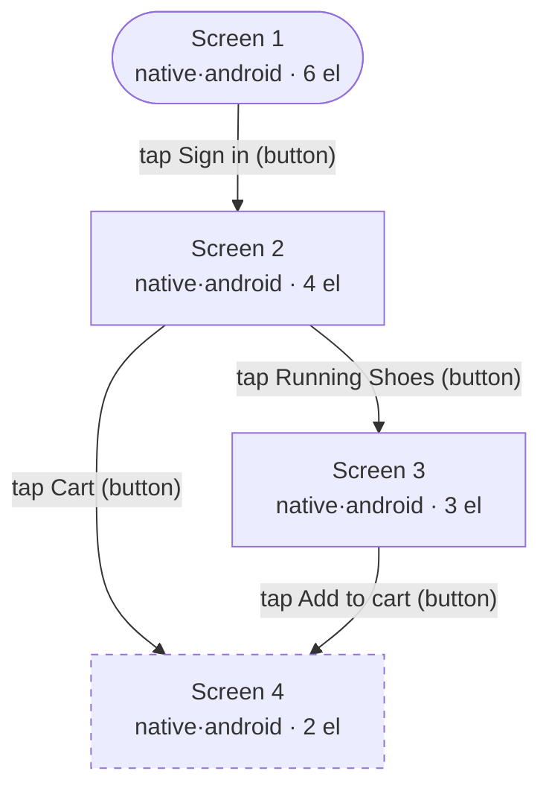

# Screen inventory — `com.example.shop`

4 screen(s) discovered by autonomous crawl.

## Screen 1 · native · android
_6 element(s) · fingerprint `login`_

| Element | Type | Locator | Interactive |
|---|---|---|---|
| Welcome back | text | `text=Welcome back` |  |
| Email | input | `accessibility_id=Email` | ✓ |
| Password | input | `accessibility_id=Password` | ✓ |
| Remember me | checkbox | `id=com.example.shop:id/remember` | ✓ |
| Sign in | button | `id=com.example.shop:id/signin` | ✓ |
| Forgot password? | text | `id=com.example.shop:id/forgot` | ✓ |

## Screen 2 · native · android
_4 element(s) · fingerprint `catalog`_

| Element | Type | Locator | Interactive |
|---|---|---|---|
| Search products | input | `accessibility_id=Search products` | ✓ |
| Running Shoes | button | `id=com.example.shop:id/p_shoes` | ✓ |
| Backpack | button | `id=com.example.shop:id/p_bag` | ✓ |
| Cart | button | `accessibility_id=Cart` | ✓ |

## Screen 3 · native · android
_3 element(s) · fingerprint `product`_

| Element | Type | Locator | Interactive |
|---|---|---|---|
| Running Shoes | text | `text=Running Shoes` |  |
| $89.00 | text | `text=$89.00` |  |
| Add to cart | button | `id=com.example.shop:id/add` | ✓ |

## Screen 4 · native · android
_2 element(s) · fingerprint `cart`_

| Element | Type | Locator | Interactive |
|---|---|---|---|
| Your cart | text | `text=Your cart` |  |
| Place order | button | `id=com.example.shop:id/order` | ✓ |

## Discovered flows
| From | Tap | To |
|---|---|---|
| Screen 1 | Sign in | Screen 2 |
| Screen 2 | Running Shoes | Screen 3 |
| Screen 2 | Cart | Screen 4 |
| Screen 3 | Add to cart | Screen 4 |

## Interaction graph
_4 screens · 4 transitions · max depth 2 · 0 cycle(s) · 1 dead-end(s) · 0 unreachable_

- **Dead-ends** (no way onward): Screen 4

## Accessibility
No accessibility issues found (all interactive elements are labelled).
