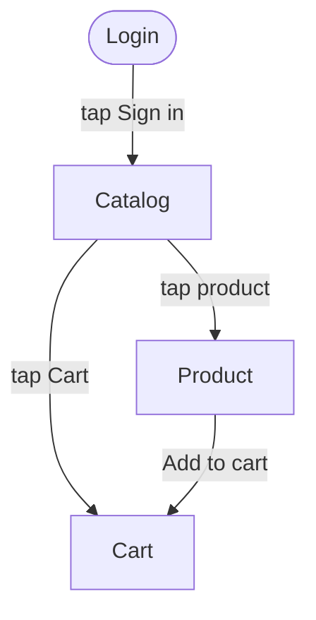

# Mobile Test Recorder — JetBrains IDE Plugin

> **Point your IDE at a running app → get an element inventory, an interaction
> graph, and runnable tests — without leaving IntelliJ / Android Studio /
> PyCharm.**

The plugin is the IDE front-end for the [Mobile Test Recorder](../README.md)
engine: you tell it *what you have* (an app, maybe its source, known logins,
where to put results), and it hands back the artifacts a tester actually needs.

Works in **every JetBrains IDE** (IntelliJ IDEA, Android Studio, PyCharm, WebStorm,
GoLand, …) via the platform SDK — one plugin, all IDEs.

---

## The idea in one picture

```
┌──────────────────────────────────────────────────────────────────────┐
│  You point at an app and say what you want…                            │
│                                                                        │
│   app (apk / bundle id) ─┐                                             │
│   source code (optional) ─┤                                            │
│   platform: Android / iOS ─┤   ▶  Mobile Test Recorder  ▶   ┌────────┐ │
│   language + framework    ─┤        (in your IDE)            │  tests │ │
│   known logins/passwords  ─┤                                 │  graph │ │
│   where to put results    ─┘                                 │ report │ │
│                                                              └────────┘ │
└──────────────────────────────────────────────────────────────────────┘
```

---

## Inside the IDE — the tool window

```
 Mobile Test Recorder ▾                                              ⟳  ⚙
┌──────────┬──────────┬───────────┬────────┐
│ Devices  │  Screen  │ Inspector │  Logs  │
├──────────┴──────────┴───────────┴────────┴───────────────────────────┐
│  ● Pixel_7_API_34  (emulator-5554)   android   ▶ start session        │
│  ● iPhone 15       (booted)          ios       ▶ start session        │
│                                                                        │
│   ┌───────────────┐   Tap / swipe / type on the live screen right     │
│   │  [ live app   │   here; the tree updates on the Inspector tab.    │
│   │   screenshot  │                                                    │
│   │   click-to-   │   Actions ▸  Setup Wizard · Generate Test ·        │
│   │     tap ]     │              Heal Selector · Fuzz · Security Scan  │
│   └───────────────┘                                                    │
└────────────────────────────────────────────────────────────────────────┘
```

*(Screenshots for the Marketplace listing go here.)*

- **Devices** — Android emulators (adb) and iOS simulators (simctl), live.
- **Screen** — a real-time screenshot you can **click to tap**.
- **Inspector** — the UI hierarchy for the current screen.
- **Logs** — streamed logcat / simctl output with filtering.

---

## The Setup Wizard collects exactly what you have

No config files. A guided wizard captures your context once and remembers it:

| You provide | Used for |
|---|---|
| **App** — package / bundle id (and build artifact) | what to crawl |
| **Source code path** *(optional)* | richer analysis |
| **Platform** — Android / iOS | driver selection |
| **Language + framework** — pytest, TestNG, WebdriverIO, … | which tests to emit |
| **Known logins / passwords / test data** | so generated flows can fill forms |
| **Output directory** | where the tests/report land in your project |

*(All stored in the plugin's settings — see `MTRSettings`.)*

---

## …and hands back a full test kit

The engine crawls the running app and produces (see a real, generated example in
[`examples/shop_demo/`](../examples/shop_demo)):

**A typed element inventory** — every element with a semantic type and a ready locator:

| Element | Type | Locator |
|---|---|---|
| Email | input | `accessibility_id=Email` |
| Password | input | `accessibility_id=Password` |
| Remember me | checkbox | `id=…:id/remember` |
| Sign in | button | `id=…:id/signin` |

**An interaction graph** of the app (renders on GitHub / in the IDE Markdown preview):



**Runnable tests** — including multi-step paths that *fill forms*, not just navigate,
generated in your chosen language (Python/Java/JavaScript today, imperative or BDD).
Plus API contract tests, an accessibility audit, and an APK/IPA security scan.

---

## Features

**Live today**
- ✅ Device management (Android emulators via adb, iOS simulators via simctl)
- ✅ Live screenshot with **click-to-tap**, session management
- ✅ UI inspector & streamed logs
- ✅ Setup Wizard + persistent settings (source, platform, language, framework, credentials, output)
- ✅ In-IDE actions: Setup Wizard · Generate Test · Heal Selector · Fuzz · Security Scan · Start/Stop Daemon
- ✅ JSON-RPC bridge to the CLI engine (`observe daemon`)

**Powered by the engine** (via the CLI, wiring into the daemon in progress)
- 🔗 Autonomous crawl → element inventory + interaction graph
- 🔗 Multi-language codegen (Python · Java · Kotlin · JavaScript; imperative + BDD)
- 🔗 Appium (Android UiAutomator2 + iOS XCUITest), on-device Espresso
- 🔗 Ranked, self-healing selectors · API tests · accessibility · security (OWASP)

---

## Requirements

- A JetBrains IDE **2023.2+** (IntelliJ, Android Studio, PyCharm, …)
- **Java 17+**, **Python 3.13+**
- The engine CLI: `pip install mobile-observe-test`
- Android: Android SDK (`adb`); iOS: Xcode (`simctl`) + Appium for device automation

## Install

**From source**
```bash
cd jetbrains-plugin
./gradlew buildPlugin
# then IDE ▸ Settings ▸ Plugins ▸ ⚙ ▸ Install Plugin from Disk…
#   build/distributions/mobile-test-recorder-*.zip
./gradlew runIde   # or launch a sandbox IDE with the plugin
```
*Marketplace listing: coming soon.*

## Architecture

```
JetBrains IDE plugin (Kotlin)                 CLI engine (Python + rust_core)
  ToolWindow: Devices · Screen                  observe daemon  (JSON-RPC 2.0)
             · Inspector · Logs      ⇄  stdio  ├─ device mgmt · screenshots
  Setup Wizard · Settings · Actions             ├─ autonomous crawl → kit
  JsonRpcClient                                 ├─ codegen (8 targets)
                                                └─ security · a11y · ML typing
```

## License

MIT — see [LICENSE](../LICENSE).
